# Frontend Project Charter: Multi-Provider AI Chat Platform

## 🎯 Project Overview

### Mission Statement
Build a sophisticated AI consultation platform that serves as both a powerful tech demo and client engagement tool for your consulting business. This application showcases your AI expertise while providing prospects with an interactive experience to learn about your services through direct conversation with an AI agent.

### Vision
Create a premium, enterprise-grade AI chat interface that demonstrates your technical capabilities while serving as a lead generation and client education tool. The platform will embody the phrase "Want to learn more about our AI services? Talk to our AI agent" - turning visitors into engaged prospects through hands-on experience with cutting-edge AI technology.

### Business Context
This application serves dual purposes:
1. **Tech Demo**: Showcase your AI/ML consulting capabilities through a live, interactive demonstration
2. **Client Engagement Tool**: Enable prospects to learn about your services through natural conversation with an AI agent that understands your business offerings, approach, and expertise

---

## 🏗️ Technical Architecture

### Core Technology Stack
- **Framework**: Nuxt 3 (Static Site Generation)
- **UI Library**: Nuxt UI Pro + Tailwind CSS
- **Language**: TypeScript (strict mode)
- **State Management**: Pinia
- **Authentication**: Firebase Auth
- **Deployment**: AWS CloudFront (static bundle)
- **Backend Integration**: FastAPI Multi-Provider LLM Platform

### Architecture Pattern


---

## 🎨 User Experience Design

### Target Users
1. **Prospective Clients** - Business leaders exploring AI consulting services
2. **Technical Decision Makers** - CTOs, Engineering Directors evaluating AI capabilities
3. **Startup Founders** - Entrepreneurs seeking AI integration expertise
4. **Enterprise Stakeholders** - Large company representatives investigating AI solutions

### Core User Journeys

#### 1. Prospect Discovery Journey
```
Website Visit → "Talk to our AI" CTA → Quick Demo Chat → 
Learn About Services → Contact Information Capture → Sales Follow-up
```

#### 2. Technical Evaluation Journey
```
Initial Demo → Request API Access → Explore Multi-Provider Features → 
Test MCP Integration → Evaluate Technical Depth → Schedule Consultation
```

#### 3. Showcase & Demonstration Journey
```
Guided Demo → Advanced Features Tour → Custom Use Case Discussion → 
Technical Deep Dive → Proposal Request → Client Onboarding
```


---

## 🔧 Feature Requirements

### Core Features (MVP)

#### Lead Generation & Demo Features
- **Instant Demo Access**
  - No-registration quick start option
  - "Talk to our AI" prominent CTA
  - Guided demo conversation flows
  - Contact capture integration
  - Demo session analytics

#### Professional Chat Interface
- **Premium UI/UX**
  - Branded, professional appearance
  - Real-time message display with smooth animations
  - Typing indicators and professional messaging
  - Message timestamps and conversation flow
  - Copy message functionality
  - Markdown rendering with code syntax highlighting
  - Mobile-responsive design for all devices

#### Multi-Provider AI Showcase
- **Technical Capability Demonstration**
  - Dynamic provider switching (Anthropic, OpenAI, Google, Ollama)
  - Model selection showcase per provider
  - Provider health status indicators
  - User-managed API keys (encrypted storage)
  - Live comparison of provider capabilities
  - Provider-specific settings demonstration

#### Professional Demo Management
- **Conversation Showcase**
  - Create new demo conversations
  - Rename and organize demo sessions
  - Professional conversation history
  - Demo session analytics and insights
  - Export conversation transcripts for follow-up
  - Share demo sessions with prospects

#### Branding & Professional Settings
- **Consultancy Brand Integration**
  - Custom branding and color schemes
  - Professional theme options
  - Your company logo and messaging
  - Custom system prompts about your services
  - Professional contact information integration
  - Client testimonial integration

### Advanced Features (Phase 2)

#### MCP Integration Showcase
- **Advanced AI Capabilities Demo**
  - Remote MCP server connections
  - Live tool execution demonstrations
  - Available tools visualization for prospects
  - Tool execution history for transparency
  - Server connection status monitoring
  - Custom MCP server integration examples

#### Lead Generation Features
- **Prospect Engagement Tools**
  - Conversation templates for common inquiries
  - Automated follow-up suggestions
  - Contact information capture forms
  - Demo session scheduling integration
  - Lead scoring based on interaction depth

#### Service Showcase Library
- **Consulting Services Demo**
  - Create custom prompts about your services
  - Showcase different AI use cases
  - Industry-specific conversation templates
  - Case study integration
  - Success story demonstrations

#### Business Intelligence & Analytics
- **Prospect Analytics**
  - Demo session tracking
  - Engagement metrics and heatmaps
  - Conversion funnel analysis
  - Lead quality scoring
  - ROI demonstration for prospects
  - Usage reports for business development

---

## 🛠️ Technical Implementation

### Project Structure
```
frontend/
├── app.vue                    # Root component
├── nuxt.config.ts            # Nuxt configuration
├── tailwind.config.ts        # Tailwind configuration
├── package.json              # Dependencies
├── tsconfig.json             # TypeScript configuration
│
├── assets/                   # Static assets
│   ├── css/                  # Global styles
│   ├── images/               # Images
│   └── icons/                # Custom icons
│
├── components/               # Reusable components
│   ├── Chat/                 # Chat-specific components
│   │   ├── ChatInterface.vue
│   │   ├── MessageBubble.vue
│   │   ├── MessageInput.vue
│   │   └── TypingIndicator.vue
│   ├── Providers/            # Provider components
│   │   ├── ProviderSelector.vue
│   │   ├── ModelSelector.vue
│   │   └── ProviderStatus.vue
│   ├── MCP/                  # MCP components
│   │   ├── MCPServerList.vue
│   │   ├── MCPToolBrowser.vue
│   │   └── MCPStatus.vue
│   ├── Settings/             # Settings components
│   │   ├── APIKeyManager.vue
│   │   ├── SystemPrompts.vue
│   │   └── UserPreferences.vue
│   └── UI/                   # Generic UI components
│       ├── LoadingSpinner.vue
│       ├── ErrorDisplay.vue
│       └── ConfirmDialog.vue
│
├── composables/              # Reusable logic
│   ├── useAuth.ts            # Authentication logic
│   ├── useAPI.ts             # API communication
│   ├── useChat.ts            # Chat management
│   ├── useProviders.ts       # Provider management
│   ├── useMCP.ts             # MCP integration
│   └── useSettings.ts        # Settings management
│
├── layouts/                  # Layout components
│   ├── default.vue           # Main layout
│   ├── auth.vue              # Authentication layout
│   └── error.vue             # Error layout
│
├── middleware/               # Route middleware
│   ├── auth.ts               # Authentication middleware
│   └── guest.ts              # Guest-only middleware
│
├── pages/                    # Route pages
│   ├── index.vue             # Home/Chat page
│   ├── login.vue             # Login page
│   ├── register.vue          # Registration page
│   ├── settings.vue          # Settings page
│   └── chat/                 # Chat routes
│       └── [id].vue          # Individual chat
│
├── plugins/                  # Plugins
│   ├── firebase.client.ts    # Firebase configuration
│   └── api.client.ts         # API client setup
│
├── stores/                   # Pinia stores
│   ├── auth.ts               # Authentication state
│   ├── chat.ts               # Chat state
│   ├── providers.ts          # Provider state
│   ├── mcp.ts                # MCP state
│   └── settings.ts           # Settings state
│
├── types/                    # TypeScript types
│   ├── auth.ts               # Authentication types
│   ├── chat.ts               # Chat types
│   ├── providers.ts          # Provider types
│   ├── mcp.ts                # MCP types
│   └── api.ts                # API types
│
└── utils/                    # Utility functions
    ├── api.ts                # API utilities
    ├── crypto.ts             # Encryption utilities
    ├── format.ts             # Formatting utilities
    └── validation.ts         # Validation utilities
```

### Key Technical Decisions

#### State Management Strategy
```typescript
// Pinia stores with TypeScript
interface ChatState {
  conversations: Conversation[]
  currentConversation: Conversation | null
  messages: Message[]
  isLoading: boolean
  error: string | null
}

interface ProviderState {
  providers: Provider[]
  currentProvider: string
  currentModel: string
  apiKeys: EncryptedApiKeys
  settings: ProviderSettings
}
```

#### API Integration Pattern
```typescript
// Composable for API communication
export const useAPI = () => {
  const config = useRuntimeConfig()
  const { $firebase } = useNuxtApp()
  
  const apiRequest = async <T>(
    endpoint: string, 
    options: RequestOptions = {}
  ): Promise<T> => {
    const token = await $firebase.auth().currentUser?.getIdToken()
    // Implementation
  }
  
  return { apiRequest }
}
```

#### Security Implementation
```typescript
// Client-side encryption for API keys
export const useEncryption = () => {
  const encryptApiKey = (key: string, userToken: string): string => {
    // Encrypt API key using user's Firebase token
  }
  
  const decryptApiKey = (encrypted: string, userToken: string): string => {
    // Decrypt API key for API calls
  }
}
```

---

## 🔄 Backend Integration Requirements

### Current Backend Status
✅ **Ready for Frontend Integration**
- Authentication via API keys
- Multi-provider support
- Chat management
- System prompt management
- MCP integration (local only)

❌ **Needs Enhancement for Remote MCP**
- WebSocket transport for MCP
- HTTP transport for MCP
- Remote MCP server management
- MCP server authentication

### Required Backend Modifications

#### 1. Remote MCP Support
```python
# Add to mcp_servers_config.json
{
  "remote_servers": {
    "websocket_server": {
      "transport_type": "websocket",
      "config": {
        "url": "ws://mcp-server.example.com:8080",
        "auth_token": "bearer_token_here"
      },
      "enabled": true
    },
    "http_server": {
      "transport_type": "http",
      "config": {
        "base_url": "https://mcp-server.example.com",
        "api_key": "api_key_here"
      },
      "enabled": true
    }
  }
}
```

#### 2. User-Specific API Keys
```python
# New endpoint for user API key management
@app.post("/user/api-keys")
async def store_user_api_key(
    provider: str, 
    encrypted_key: str,
    current_user: User = Depends(get_current_user)
):
    # Store encrypted API key for user
    pass
```

#### 3. MCP Server Management
```python
# New endpoints for MCP server management
@app.post("/mcp/servers")
async def add_remote_mcp_server(
    server_config: RemoteMCPServerConfig,
    current_user: User = Depends(get_current_user)
):
    # Add remote MCP server for user
    pass
```

---

## 📊 Development Phases

### Phase 1: Foundation (Weeks 1-3)
- **Week 1**: Project setup, authentication, basic UI
- **Week 2**: Chat interface, provider integration
- **Week 3**: Settings, API key management

### Phase 2: Core Features (Weeks 4-6)
- **Week 4**: Chat history, conversation management
- **Week 5**: System prompt management, UI polish
- **Week 6**: Testing, bug fixes, performance optimization

### Phase 3: Advanced Features (Weeks 7-9)
- **Week 7**: MCP remote server integration
- **Week 8**: Advanced chat features, analytics
- **Week 9**: Final testing, deployment preparation

### Phase 4: Production & Enhancement (Weeks 10-12)
- **Week 10**: Production deployment, monitoring
- **Week 11**: User feedback integration, bug fixes
- **Week 12**: Performance optimization, future planning

---

## 🎯 Success Metrics

### User Engagement
- Daily active users
- Average session duration
- Messages per session
- Conversation retention rate

### Technical Performance
- Page load time < 2 seconds
- API response time < 500ms
- 99.9% uptime
- Error rate < 0.1%

### Feature Adoption
- Multi-provider usage rate
- MCP server connection rate
- System prompt usage
- API key management adoption

---

## 🔒 Security Considerations

### Client-Side Security
- API key encryption before storage
- Secure token management
- Input validation and sanitization
- XSS prevention

### Communication Security
- HTTPS only
- API key transmission encryption
- Firebase Auth integration
- CORS configuration

### Data Protection
- No sensitive data in localStorage
- Encrypted API key storage
- User data isolation
- Privacy compliance

---

## 🚀 Deployment Strategy

### Build Configuration
```typescript
// nuxt.config.ts
export default defineNuxtConfig({
  ssr: false,
  nitro: {
    prerender: {
      routes: ['/']
    }
  },
  runtimeConfig: {
    public: {
      firebaseConfig: {
        // Firebase configuration
      },
      apiBaseUrl: process.env.API_BASE_URL
    }
  }
})
```

### CloudFront Configuration
- Static asset caching
- Route handling for SPA
- Compression enabled
- Security headers

### CI/CD Pipeline
```yaml
# GitHub Actions workflow
name: Deploy to CloudFront
on:
  push:
    branches: [main]
jobs:
  deploy:
    steps:
      - name: Generate static site
        run: npm run generate
      - name: Deploy to S3
        run: aws s3 sync dist/ s3://bucket
      - name: Invalidate CloudFront
        run: aws cloudfront create-invalidation
```

---

## 📝 Development Guidelines

### Code Quality
- TypeScript strict mode
- ESLint + Prettier
- Conventional commits
- Unit testing with Vitest
- E2E testing with Playwright

### Component Architecture
- Composition API
- Single responsibility principle
- Proper props/emits typing
- Accessibility compliance

### Performance Optimization
- Code splitting
- Lazy loading
- Image optimization
- Bundle analysis
- Progressive enhancement

---

## 🔮 Future Enhancements

### Phase 5: Electron Desktop Application Module

#### Business Strategy
Transform the web application into a powerful desktop distribution tool that serves as both a lead generation magnet and a technical showcase of local MCP capabilities.

#### Value Proposition
- **Lead Magnet**: "Like this website? Want to use it yourself for free and run your own MCP servers locally without being restricted to Claude Desktop? Here you go - just give me your email!"
- **Technical Differentiation**: Unlimited MCP servers vs Claude Desktop's limitations
- **Local-First Approach**: All data stays on user's machine
- **Professional Credibility**: Desktop app demonstrates serious technical capability

#### Technical Architecture

##### Electron + FastAPI Integration

```mermaid
graph TB
    subgraph "Desktop Application"
        subgraph "Electron Main Process"
            FastAPIBackend[🚀 FastAPI Backend<br/>Embedded]
            MCPHost[🔌 MCP Host<br/>Local]
            StaticBundle[📦 Static Web Bundle<br/>Nuxt Build]
            MCPManager[📡 MCP Manager]
            IPCBridge[🔗 IPC Bridge]
        end
        
        subgraph "Electron Renderer"
            WebInterface[🌐 Web Interface]
            ElectronAPI[⚡ Electron APIs]
        end
    end
    
    subgraph "Local MCP Servers"
        FileSystem[📂 Filesystem Server<br/>stdio]
        GitHub[🐙 GitHub Server<br/>stdio]
        CustomServers[⚙️ Custom Servers<br/>stdio]
    end
    
    subgraph "External Services"
        AIProviders[🤖 AI Provider APIs]
        EmailService[📧 Email Capture Service]
        Analytics[📊 Usage Analytics]
    end
    
    %% Internal connections
    FastAPIBackend --> MCPHost
    MCPHost --> MCPManager
    StaticBundle --> WebInterface
    WebInterface --> IPCBridge
    IPCBridge --> ElectronAPI
    ElectronAPI --> MCPManager
    
    %% MCP connections
    MCPHost --> FileSystem
    MCPHost --> GitHub
    MCPHost --> CustomServers
    
    %% External connections
    FastAPIBackend --> AIProviders
    ElectronAPI --> EmailService
    ElectronAPI --> Analytics
    
    %% Styling
    classDef desktop fill:#e3f2fd,stroke:#1976d2,stroke-width:2px,color:#000000
    classDef mcp fill:#fff3e0,stroke:#f57c00,stroke-width:2px,color:#000000
    classDef external fill:#f3e5f5,stroke:#7b1fa2,stroke-width:2px,color:#000000
    
    class FastAPIBackend,MCPHost,StaticBundle,MCPManager,IPCBridge,WebInterface,ElectronAPI desktop
    class FileSystem,GitHub,CustomServers mcp
    class AIProviders,EmailService,Analytics external
```



##### Core Implementation Components

###### Electron Main Process
```javascript
// electron-main.js
const { app, BrowserWindow } = require('electron');
const { spawn } = require('child_process');
const path = require('path');

class DesktopApp {
  constructor() {
    this.fastApiProcess = null;
    this.window = null;
    this.mcpServers = new Map();
  }
  
  async startBackend() {
    // Start embedded FastAPI server on random port
    this.fastApiProcess = spawn('python', [
      path.join(__dirname, 'backend/main.py'),
      '--port', '0'  // Let OS choose port
    ]);
    
    await this.waitForBackend();
  }
  
  async startMCPServers() {
    // Start local MCP servers based on config
    const config = await this.loadMCPConfig();
    for (const [name, serverConfig] of Object.entries(config)) {
      await this.startMCPServer(name, serverConfig);
    }
  }
  
  createWindow() {
    this.window = new BrowserWindow({
      width: 1200,
      height: 800,
      webPreferences: {
        nodeIntegration: false,
        contextIsolation: true,
        preload: path.join(__dirname, 'preload.js')
      }
    });
    
    // Load the static Nuxt build
    this.window.loadFile('dist/index.html');
  }
}
```

###### Desktop-Specific Features
```javascript
// preload.js - Electron IPC bridge
const { contextBridge, ipcRenderer } = require('electron');

contextBridge.exposeInMainWorld('electronAPI', {
  // MCP server management
  startMCPServer: (config) => ipcRenderer.invoke('start-mcp-server', config),
  stopMCPServer: (name) => ipcRenderer.invoke('stop-mcp-server', name),
  getMCPServers: () => ipcRenderer.invoke('get-mcp-servers'),
  
  // File system access
  selectDirectory: () => ipcRenderer.invoke('select-directory'),
  readFile: (path) => ipcRenderer.invoke('read-file', path),
  
  // Analytics (privacy-compliant)
  trackUsage: (event) => ipcRenderer.invoke('track-usage', event),
  
  // Email capture
  submitEmail: (email) => ipcRenderer.invoke('submit-email', email)
});
```

##### Enhanced Desktop Features

###### MCP Server Management UI
```vue
<!-- components/Desktop/MCPServerManager.vue -->
<template>
  <div class="mcp-server-manager">
    <div class="server-list">
      <div v-for="server in mcpServers" :key="server.name" class="server-item">
        <div class="server-info">
          <h3>{{ server.name }}</h3>
          <p>{{ server.description }}</p>
          <div class="server-status" :class="server.status">
            {{ server.status }}
          </div>
        </div>
        <div class="server-actions">
          <button @click="toggleServer(server)" :disabled="server.loading">
            {{ server.status === 'running' ? 'Stop' : 'Start' }}
          </button>
          <button @click="configureServer(server)">Configure</button>
        </div>
      </div>
    </div>
    
    <div class="add-server">
      <h3>Add MCP Server</h3>
      <form @submit.prevent="addServer">
        <input v-model="newServer.name" placeholder="Server name" required>
        <input v-model="newServer.command" placeholder="Command" required>
        <input v-model="newServer.args" placeholder="Arguments">
        <button type="submit">Add Server</button>
      </form>
    </div>
  </div>
</template>

<script setup lang="ts">
interface MCPServer {
  name: string;
  command: string;
  args: string[];
  status: 'running' | 'stopped' | 'error';
  loading: boolean;
}

const mcpServers = ref<MCPServer[]>([]);
const newServer = ref({ name: '', command: '', args: '' });

const toggleServer = async (server: MCPServer) => {
  server.loading = true;
  try {
    if (server.status === 'running') {
      await window.electronAPI.stopMCPServer(server.name);
      server.status = 'stopped';
    } else {
      await window.electronAPI.startMCPServer(server);
      server.status = 'running';
    }
  } catch (error) {
    server.status = 'error';
  } finally {
    server.loading = false;
  }
};
</script>
```

###### Email Capture Integration
```vue
<!-- components/Desktop/EmailCapture.vue -->
<template>
  <div class="email-capture-modal" v-if="showModal">
    <div class="modal-content">
      <h2>Get This Tool for Free!</h2>
      <p>Enter your email to download the desktop version with full MCP support</p>
      
      <form @submit.prevent="submitEmail">
        <input 
          v-model="email" 
          type="email" 
          placeholder="your@email.com" 
          required
        >
        <button type="submit" :disabled="submitting">
          {{ submitting ? 'Submitting...' : 'Get Free Desktop App' }}
        </button>
      </form>
      
      <div class="benefits">
        <h3>What you get:</h3>
        <ul>
          <li>✅ Unlimited MCP servers</li>
          <li>✅ Local file system access</li>
          <li>✅ No cloud dependencies</li>
          <li>✅ Custom server support</li>
          <li>✅ Multi-provider AI access</li>
        </ul>
      </div>
    </div>
  </div>
</template>

<script setup lang="ts">
const email = ref('');
const submitting = ref(false);
const showModal = ref(false);

const submitEmail = async () => {
  submitting.value = true;
  try {
    await window.electronAPI.submitEmail(email.value);
    // Show success message and start download
    showSuccessMessage();
    startDownload();
  } catch (error) {
    showErrorMessage();
  } finally {
    submitting.value = false;
  }
};
</script>
```

#### Distribution Strategy

##### Cross-Platform Build Process
```json
{
  "name": "ai-chat-desktop",
  "version": "1.0.0",
  "main": "dist-electron/main.js",
  "scripts": {
    "electron:build": "nuxt build && electron-builder",
    "electron:build:all": "nuxt build && electron-builder --mac --win --linux",
    "electron:dev": "nuxt dev & electron .",
    "package": "npm run electron:build:all"
  },
  "build": {
    "appId": "com.yourconsultancy.ai-chat",
    "productName": "Professional AI Chat",
    "directories": {
      "output": "dist-electron"
    },
    "files": [
      "dist/**/*",
      "backend/**/*",
      "electron/**/*"
    ],
    "mac": {
      "category": "public.app-category.productivity",
      "target": "dmg"
    },
    "win": {
      "target": "nsis"
    },
    "linux": {
      "target": "AppImage"
    }
  }
}
```

##### Auto-Update System
```javascript
// electron-updater.js
const { autoUpdater } = require('electron-updater');

class AppUpdater {
  constructor() {
    autoUpdater.checkForUpdatesAndNotify();
    
    autoUpdater.on('update-available', () => {
      // Notify user of available update
      this.showUpdateNotification();
    });
    
    autoUpdater.on('update-downloaded', () => {
      // Ask user to restart
      this.showRestartDialog();
    });
  }
  
  showUpdateNotification() {
    // Show non-intrusive update notification
    const notification = new Notification('Update Available', {
      body: 'A new version is available. It will be downloaded in the background.',
      icon: 'icon.png'
    });
  }
}
```

#### Marketing & Lead Generation Integration

##### Usage Analytics (Privacy-Compliant)
```javascript
// analytics.js
class DesktopAnalytics {
  constructor() {
    this.userId = this.generateAnonymousId();
    this.events = [];
  }
  
  track(event, properties = {}) {
    this.events.push({
      event,
      properties: {
        ...properties,
        timestamp: Date.now(),
        userId: this.userId
      }
    });
    
    // Batch send to analytics endpoint
    this.sendBatch();
  }
  
  async sendBatch() {
    // Send anonymized usage data for business intelligence
    // Help improve the product and understand user behavior
  }
}
```

##### Lead Generation Workflow
```
Desktop App Usage → Feature Engagement → 
Email Capture Trigger → Download Distribution → 
Email Nurture Sequence → Consultation Booking
```

#### Implementation Timeline

##### Phase 5A: Electron Foundation (2-3 weeks)
- Electron app setup and configuration
- Embed FastAPI backend
- Static Nuxt build integration
- Basic MCP server management
- Cross-platform build process

##### Phase 5B: Desktop Features (2-3 weeks)
- Enhanced MCP server UI
- Local file system integration
- Email capture system
- Usage analytics implementation
- Auto-updater system

##### Phase 5C: Distribution & Marketing (1-2 weeks)
- Signed installers for all platforms
- Download page and marketing materials
- Email nurture sequence setup
- Analytics dashboard for lead tracking

#### Success Metrics

##### Technical Metrics
- Cross-platform compatibility (Windows, macOS, Linux)
- App launch time < 5 seconds
- MCP server startup time < 2 seconds
- Zero-config local setup

##### Business Metrics
- Email capture conversion rate (target: 30% of downloads)
- Lead quality score (engagement depth)
- Consultation booking rate from email list
- Desktop app retention rate

#### Competitive Advantages

##### vs Claude Desktop
- ✅ Unlimited MCP servers (vs Claude's limitations)
- ✅ Multi-provider support (vs Claude only)
- ✅ Custom branding and configuration
- ✅ Professional consulting backing

##### vs Web-Only Solutions
- ✅ Local data processing
- ✅ Offline capability
- ✅ Native OS integration
- ✅ Professional desktop experience

### Phase 6: Enterprise Features
- Team management
- Organization accounts
- Usage analytics dashboard
- Custom branding
- SSO integration

This project charter provides a comprehensive roadmap for building a world-class AI chat frontend that perfectly complements your FastAPI backend. The modular approach ensures scalability while the clear phases enable manageable development cycles.